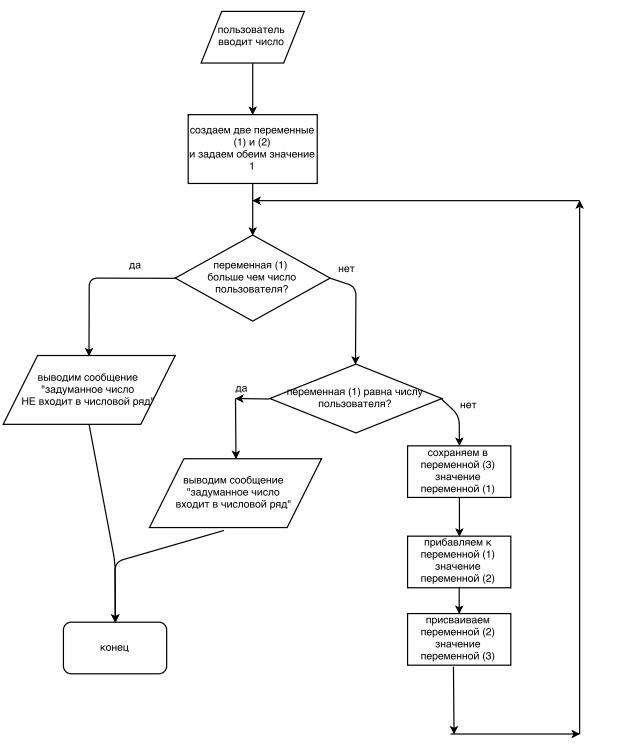

# Домашнее задание к лекции 1.2 «Основы PHP»

Реализуйте предложенный алгоритм на языке PHP.



Догадались ли вы, какую задачу он решает и как называется числовой ряд, который используется в задании? Напишите в комментарии.

## Советы:
* Пункт «пользователь вводит число» можете пока реализовать через `$x = rand(0,100);` и затем сделайте `echo "Число ".$x;`, чтобы видеть с каким числом идет работа.
* Можно по-честному: `$x = $_GET['x'];`. В этом случае вы должны будете передать число в строке браузера `````(script.php?x=100) — именно так пользователи и передают данные в большинстве случаев. Подробнее о получении данных от пользователя вы узнаете далее в курсе.
